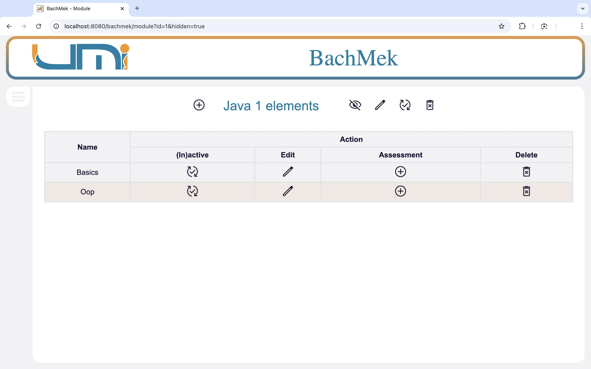

# Bachmek &nbsp; 

## Context
During my 4th semester in 2022 at the Moulay Ismail University in Morocco, each one of the student was tasked with creating a specific JEE web application. I was tasked with creating a webapp that would manage the evaluation / grading process of a university. This webapp was to be complete and handles all the different components that are required for the evaluation process, i.e. students, teachers, administrators, courses, modules, semesters, registrations, marks, etc...

You can read the specification booklet that was given to me [here](extra/specifications.pdf). However, it is in French.

I was pretty excited to work on this project, as that it represented a **real challenge**. It was a relatively big scale project, and we had to learning about the new technology (JEE) as to adhere to the specifications, all in the duration of around 5 months, while still having other modules to juggle. [This](extra/images/timetable.jpeg) is what our time table looked like that semester.

## Development journey (personal experience)
I first took some good time reading and understanding the specifications. Then I designed the class diagram of the project, which you can see [here](extra/images/class_diagram.webp). Then I started learning JEE, namely off of this [book](https://www.murach.com/shop/murach-s-java-servlets-and-jsp-3rd-edition-detail). It helped quite a lot as that it was comprehensive. But that alone took me around 2 months, and was yet to write a single line of code. [Here](extra/images/gantt.webp) is the Gantt chart if you want to see how the work ended up being divided, although it is in French again.

Seeing that I was **very** short in time, and that I still literally had the whole project to implement, I started coding like I have never coded in my entire life. I was coding non-stop everyday, from the moment I woke up, until the moment I went to bed. I **hated** it. I was **exhausted** and **tired**. But I wanted it to be done, and I wanted it to be operational and good, and actually usable, and not just presentation-usable. Thankfully, I was able to do so, and really just in the nick of time. I coded and implemented the last component of the webapp the evening before the presentation day. And then pulled an all-nighter to write the report.

I learned quite a bit from this experience, and aside from the new technologies and whatnot, I also learned something very important, which is prioritizing my self and my health, and not neglecting my self and everything for a school project. I learned that I should've said

  > Fuck that shit, if we don't finish it, we don't finish it.

and take a couple of breaks and take care of my self.

Never the less, good experience, would recommend. 👍🏼

## UI / UX snippets
The style wasn't a top priority but I didn't want the website to be hideous neither. Worth noting is that I only knew HTML, CSS, and JS at the time, and that I did **everything** my self, no template, no nothing.
Also, the bulk of the application was the administrator part, so that's where most of the snippets are from.

### The landing page

Those little majors icons circled and floated around the logo.

### Student applying

A student can apply to join the program from this page.

### Admin landing page

When an admin logged in, this is what he was presented with. I was proud of the little menu on the side that can be closed. 😊

### Academic years list

The admin can manage the academic years from this page.

### Modules list

The admin can manage the modules from this page.

### Module elements

Each module had elements.

### Assessments

And then each element had assessments, like exams or homework.

### Pedagogical registrations

A pedagogical registration is when a student registers to a module.

### Accounts management

The admin can manage the different account types from this page.

### Instructors list

He can assign instructors to modules here.

### Approving marks

The admin can approve the marks that the instructors have entered, and thus "seal" them so that they can't be modified.

### Marks

Here the admin can download the marks either of a module, a semester, or for the whole year.


Here is an example of the downloaded marks table.

### Student landing page

When a student logs in, this is what he was presented with.


And this is where he could see his marks.

There are a lot more pages and functionalities, but those are some snippets of the UI / UX.

## How to run
The project was originally developed in Eclipse integrated JEE environment, where it handles deployment and everything. But I turned it into a Maven project before uploading it here.

### The database
The project obviously requires a database, and a MySql database was used. So to run the project you first need to create a database in your MySql server (just locally). And then run this [script](db_scripts/reset.sql) to create the tables.

An empty database isn't that useful, so [here](db_scripts/basic_dummy_data.sql) are some simple dummy data that you can insert.

After doing that, you also need to configure the persistence unit in this [persistence.xml](src/main/resources/META-INF/persistence.xml) file, so that the application would know which database to use, and with which user to log into it.

### Deploying the project
Once the database is ready and the MySql server is running, simply package the project using Maven, and deploy the generated `.war` file to your Servlet container.

You can package the project by running this command in the project's root directory:
```bash
mvn clean package
```

That would generate a `.war` file in the `target` directory, which you then deploy to your Servlet container. I tested it with `Apache Tomcat 10.0.17`, but it should work with any other container.

### Dummy data
In addition to the basic dummy date available in the [basic_dummy_data.sql](db_scripts/basic_dummy_data.sql) file, there is also a couple more that you can find in this the `db_scripts` directory. As well as some excel dummy data in the `excel_dummy_data` directory.

## Side note
While working on this project, I noticed that I was doing a lot of repetitive tasks, and that many things could be automated and made **a lot** easier when working with JEE. That inspired me to make [Jeext](https://github.com/telos-matter/Jeext). A collection of tools that made working with JEE a bit more barrable.

I originally developed these tools and functionalities in conjunction with this project / inside it. After finishing the project however, I took them out and made them into a separate project, added a lot more functionalities and kept working on it.

But anyhow, I would not recommend using `Jeext` as that I abandoned the project eventually, and you should use something like [Spring](https://spring.io/) instead.
